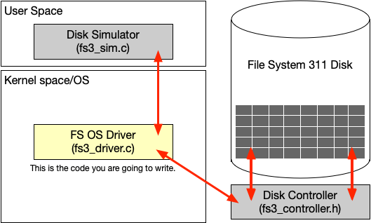

# The “File System 311” - FS3 Filesystem (Version 3.0) - CMPSC311 - Introduction to Systems Programming - Fall 2021 - Prof. McDaniel

## Description

All remaining assignments for this class are based on the creation and extension of a user-space device driver for a filesystem that is built on top of a virtual disk drive. At the highest level, you will translate file system commands into disk operations (see disk interface specification below). The file system commands include `mount`, `unmount`, `open`, `read`, `write`, `seek` and `close` for files that are written to the file system. These operations perform the same as the normal UNIX I/O operations, with the caveat that they direct file operations to the FS3 device instead of the host filesystem. The arrangement of software is as follows:



---
## System and Project Overview

You are to write a device driver that will sit between a virtual application and virtualized hardware. The driver will implement the basic file operations shown above. Described in details below, we can see three layers. The FS3 application is provided to you and will call your device driver functions with the basic UNIX file operations (`open`, etc.). You are to write the device driver code to implement the file operations. Your code will communicate with a controller by sending command blocks (data structure, see below) and data through a series of system calls (`fs3_syscall`).

All of the code for application (called the simulator) and FS3 disk interface (controller) is given to you. Numerous utility functions are also provided to help debug and test your program, as well as create readable output. Sample workloads have been generated and will be used to extensively test the program. Students that make use of all of these tools (which take a bit of time up front to figure out) will find that the later assignments will become much easier to complete.

---
## The FS3 Driver

You are to write the driver that will implement the basic UNIX file interface using the FS3 disk. You will write code to implement the filesystem, and make several design decisions that will determine the structure and performance of the driver. In essence you will write code for the `read`, `write`, `open`, `close` and `other high level` filesystem functions. Each function will translate the call into low-level operations on the device (see below).

The functions you will implement are:

- `int32_t fs3_mount_disk(void);` - This function will initialize the FS3 interface basic filesystem by “mounting” it. To do this you will call the mount opcode. You will also need to setup your internal data structures that track the state of the filesystem.

- `int32_t fs3_unmount_disk(void);` - This function will shutdown the FS3 interface basic filesystem. To do this you will execute the unmount FS3 opcode and close all of the files. You will also need to cleanup your internal data structures that track the state of the filesystem.

- `int16_t fs3_open(char *path);` - This function will open a file (named `path`) in the filesystem. If the file does not exist, it should be created and set to zero length. If it does exist, it should be opened and its read/write position should be set to the first byte. Note that there are no subdirectories in the filesystem, just files (so you can treat the `path` as a filename). The function should return a unique file handle used for subsequent operations or -1 if a failure occurs.

- `int16_t fs3_close(int16_t fd);` - This function closes the file referenced by the file handle that was previously open. The function should fail (and return -1) if the file handle is bad or the file was not previously open.

- `int32_t fs3_read(int16_t fd, void *buf, int32_t count);` - This function should read count bytes from the file referenced by the file handle at the current position. Note that if there are not enough bytes left in the file, the function should read to the end of the file and return the number of bytes read. If there are enough bytes to fulfill the read, the function should return the count of the number of actual bytes read. The function should fail (and return -1) if the file handle is bad or the file was not previously open.

- `int32_t fs3_write(int16_t fd, void *buf, int32_t count);` - The function should write count bytes into the file referenced by the file handle. If the write goes beyond the end of the file the file size should be increased. The function should always return the number of bytes written, e.g., count. The function should fail (and return -1) if the file handle is bad or the file was not previously open.

- `int32_t fs3_seek(int16_t fd, uint32_t loc);` - The function should set the current position into the file to loc, where 0 is the first byte in the file. The function should fail (and return -1) if the loc is beyond the end of the file, the file handle is bad, or the file was not previously open.

The key to this assignment if figuring out what you need to do to implement these functions. You are specifically not given guidance on how to do it. You need to:
- Maintain information about current files in the file system
- Allocate parts if the disk to place data
- Copy data into and out of the memory system as needed to serve reads and writes. 

How you do this is up to you, but think careful about it before beginning to code. What is important is that the code you write will be built upon the whole semester.

---
## The FS3 Disk

You will implement your driver on top of the FS3 disk (which is referred to throughout simply as the FS3).  The FS3 is a typical disk with multiple tracks which contain multiple sectors.  Some key facts of the system include (see `fs3_controller.h` for definitions):

- There are `FS3_MAX_TRACKS` tracks in the system, each of which is numbered from `0` to `FS3_MAX_TRACKS -1`.
- Each track contains `FS3_TRACK_SIZE` sectors, each of which is numbered from `0` to `FS3_TRACK_SIZE -1`.
- A sector is a data block of `FS3_SECTOR_SIZE` bytes. 

You communicate with the disk controller by calling a system call (`fs3_syscall`) function with a command block and a buffer.

A command block is a 64-bit value that encodes arguments to the disk. The command block is laid out as follows:


| Bits  | Register (note that top is bit 0) |
| :---: | :-------------------------------: |
| 0-3   | Opcode (command)                  |
| 4-19  | Sector number                     |
| 20-51 | Track number                      |
|  52   | Return value                      |
| 53-63 | UNUSED                            |

An opcode is a command type that tells the disk what you are doing.

The following opcodes define how you interact with the controller. Note that the UNUSED parts of the opcode should always be zero, as should any register not explicitly listed in the specifications below. If the sector argument is not specified, then it should be passed as `NULL`.

- `FS3_OP_MOUNT` (mount disk – must be called first)\
Sec = 0, trk = 0, ret = 0

- `FS3_OP_TSEEK` (seek to a new track)\
Sec = 0, trk = `<track to select>`, ret = 0

- `FS3_OP_RDSECT` (read sector from current track)\
Sec = `<sector to read>`, trk = 0, ret = 0

- `FS3_OP_WRSECT` (write sector @current track)\
Sec = `<sector to write>` trk = 0, ret = 0

- `FS3_OP_UMOUNT` (unmount the disk, called last)\
Sec = 0, trk = 0, ret = 0


To execute an opcode, create a 64 bit value (`uint64_t`) and pass it any needed buffers to the bus function defined in `fs3_controller.h`:

```
FS3CmdBlk fs3_syscall(FS3CmdBlk cmdblock, void *buf);
```

You communicate with devices though by passing a command block (`FS3CmdBlk`) and a data pointer (`buf`) to `fs3_sycall`.  The command block contains fields of different sizes that encode the opcode and arguments for the system call.  The “data” associated with the opcode (where needed) is communicated through the fixed sized transfer buffer (of size `FS3_SECTOR_SIZE`).​

Additionally, `fs3_syscall` returns you the same command block `FS3CmdBlk` you passed to it during the call with some fields updated: 
- The return value indicating you if the call you made was a success (`0`) or if an error happened (`-1`)
- For read and write sector operations, the sector number is being updated for the new one in the command block returned by `fs3_syscall`

The key thing to know about the disk is that it has a track read element.  When the device is mounted the track head is resting in a neutral position (i.e., it is not pointing at any track).  To move the track head you call the `TSEEK` operator to move it.  There after you can read any sector, one-by-one, by calling the `RDSECT` or `WRSECT` functions.  When you are done you call the `UMOUNT` operator.

---
## Part 2 Overview

There are two parts to this new assignment. These include:

1. **Workload:** The new workload (`assign3-workload.txt`) contains multiple files (up to 10) and each of the files may increase in size to a maximum of 10KB. Your code must be modified to support these new kinds of opens, reads, writes, and closes. The major new logic for your code will involve dealing with reads and writes that span multiple sectors.
  
2. **Cache:** You are to create a write-through Least Recently Used (LRU) cache that will support caching sectors in memory. The cache rules are:

  - a) Every read or write should check the cache for the desired sector before accessing the disk via the system calls (`fs3_syscall`).

  - b) Every time a sector is retrieved it should be inserted into the cache.

  - c) If the cache is full when a sector is being inserted, the least recently used (LRU) sector should be ejected and the associated memory freed.
 
You are to implement the cache in the file (`fs3_cache.c`) whose declarations are made in (`fs3_cache.h`). The functions are:

- `int fs3_init_cache(uint16_t cachelines);` - This function will initialize the cache with a parameter that sets the maximum size of the cache (number of sectors that may be held in the cache). **Note that this function is called by the simulator**, so you don’t need to call it yourself. We will test the program with different cache sizes, including a cache size of zero.
 
- `int fs3_close_cache(void);` - This function closes the cache, freeing any sectors held in it. This is called by the simulator at the end of the workload, so you don’t need to call it yourself.

- `int fs3_put_cache(FS3TrackIndex trk, FS3SectorIndex sct, void *buf);` - This inserts a sector into the cache. Note the cache uses the track and sector numbers to know which sectors are held. Be careful to make sure that the sector is malloc'd already before trying to use it. If the cache is full the least recently sector will be freed. Newly inserted sectors should be marked as the most recently used.
 
- `void * fs3_get_cache(FS3TrackIndex trk, FS3SectorIndex sct);` - This function gets an element from the cache (returns `NULL` if not found). It uses the track and sector numbers as passed into the put cache method. Returned sectors should be marked as most recently used.
 
- `int fs3_log_cache_metrics(void);` - This function will use the logMessage interface to log the performance of the cache, including hits, misses, attempts, and hit ratio (see sample output). Note that this will require you to create some global data structures to hold statistics that are continuously updated by the above functions.
 
The key to this assignment is to design a data structure that holds the cache items and is resizable based on the parameter passed to the init cache function. We strongly suggest you work out the details of the cache and its function prior to implementing it.

---
## Part 3 (FINAL) Overview

In this assignment you are to modify your driver code to connect over the network to another machine on which the disk controller runs. You are to write the corresponding network code in the file `fs3_network.c` whose declarations are made in `fs3_network.h`. The function to write is:

`int network_fs3_syscall(FS3CmdBlk cmd, FS3CmdBlk *ret, void *buf);`
```
Params:
  cmd - as previous assignments
  ret - pointer to place where to put the returned command block (with ret bit)
  buf - as previous assignments
Returns:
  0 if successful, -1 if _network_ failure
  ```
  
This function is the client/network system call, you should connect over the network to communicate with the disk controller. Connect to the disk controller when a `mount` operation needs to be performed and disconnect when performing an `unmount` operation.

In the rest of your code, you will need to replace all your calls to `fs3_syscall` by a call to `network_fs3_syscall`. 

You should use the IP address and port defined in `fs3_network.h` to setup your networking socket: 
 - IP address: `extern unsigned char *fs3_network_address;` if this is `NULL` use `FS3_DEFAULT_IP`.
 - Port: `extern unsigned short fs3_network_port;` if this is `0`, use `FS3_DEFAULT_PORT`.
  
**Note:** the server network code for the disk controller is already implemented, you only need to implement the client network code for your driver to connect to the disk controller. Your `network_fs3_syscall` function should connect to the server when necessary, send the corresponding command block and buffer (if non `NULL`) back to back at once, and receive the command block and buffer (depending on the operation being performed) returned by the disk controller through the socket.
